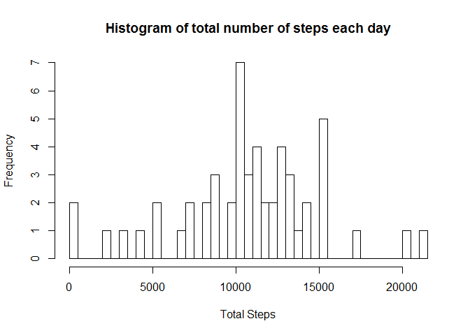
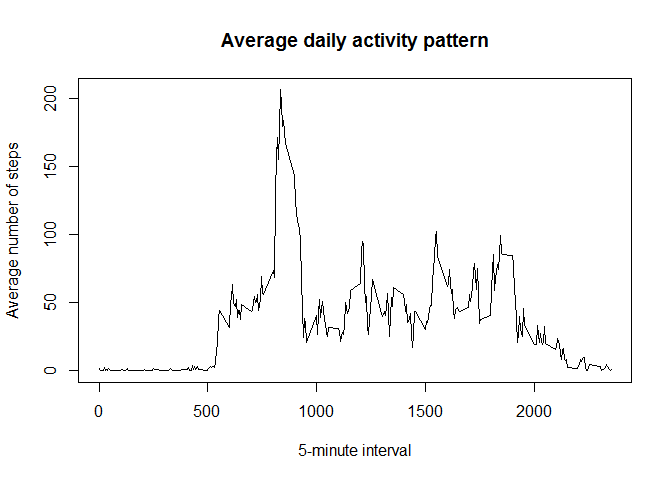
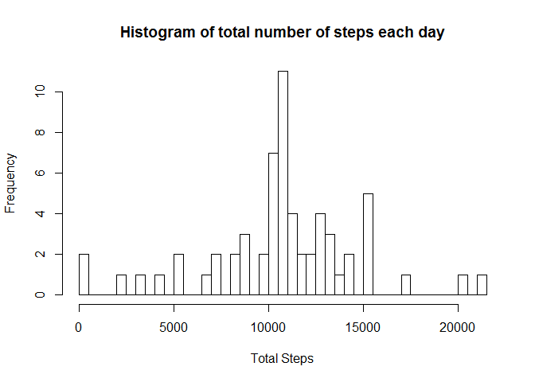
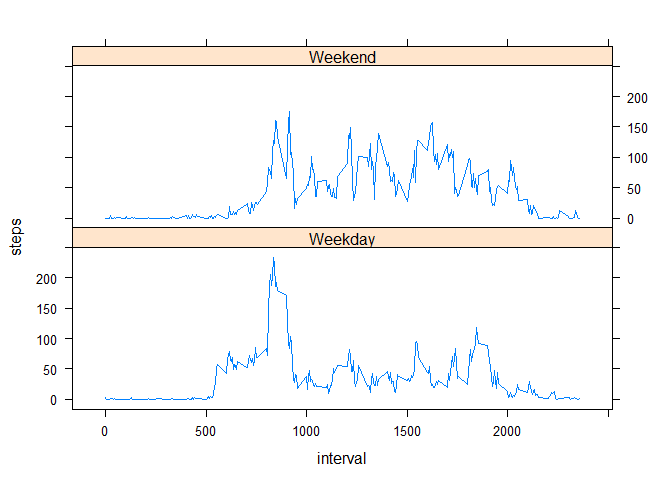

# Reproducible Research: Peer Assessment 1


## Loading and preprocessing the data

**Show any code that is needed to**

**1. Load the data (i.e. read.csv())**

- Assumes data file is present in current working directory. 

- Read file into a data frame.

```r
d <- read.csv("activity.csv")
```

**2. Process/transform the data (if necessary) into a format suitable for your analysis**

- Check the data structure to see if it needs any transformations.

```r
str(d)
```

```
## 'data.frame':	17568 obs. of  3 variables:
##  $ steps   : int  NA NA NA NA NA NA NA NA NA NA ...
##  $ date    : Factor w/ 61 levels "2012-10-01","2012-10-02",..: 1 1 1 1 1 1 1 1 1 1 ...
##  $ interval: int  0 5 10 15 20 25 30 35 40 45 ...
```

- I'll add a column for Weekday/Weekend to address the last question. Assuming *lubridate* package is installed.

```r
library(lubridate)
```

```
## Warning: package 'lubridate' was built under R version 3.1.2
```

```r
d <- within(d, DayType <- ifelse(wday(date) %in% c(1,7), "Weekend", "Weekday"))
str(d)
```

```
## 'data.frame':	17568 obs. of  4 variables:
##  $ steps   : int  NA NA NA NA NA NA NA NA NA NA ...
##  $ date    : Factor w/ 61 levels "2012-10-01","2012-10-02",..: 1 1 1 1 1 1 1 1 1 1 ...
##  $ interval: int  0 5 10 15 20 25 30 35 40 45 ...
##  $ DayType : chr  "Weekday" "Weekday" "Weekday" "Weekday" ...
```

Looks good now. (Ignore the warning about lubridate - I am using R version 3.1.1)

## What is mean total number of steps taken per day?

**1. Make a histogram of the total number of steps taken each day**

I will do this by plotting an histogram from an aggregated data frame containing the total steps per day. Days with missing values are ignored.


```r
ds <- aggregate(steps ~ date, data = d, sum)
hist(ds$steps, breaks=50, main="Histogram of total number of steps each day", xlab="Total Steps")
```

 

**2. Calculate and report the mean and median total number of steps taken per day**

I already have the total number of steps. I will simply call *summary* for getting the mean, median and other stats. 


```r
summary(ds$steps)
```

```
##    Min. 1st Qu.  Median    Mean 3rd Qu.    Max. 
##      41    8841   10760   10770   13290   21190
```


## What is the average daily activity pattern?


**1. Make a time series plot (i.e. type = "l") of the 5-minute interval (x-axis) and the average number of steps taken, averaged across all days (y-axis)**

I'll plot another aggregated data frame with averages by interval this time. 


```r
dt <- aggregate(steps ~ interval, data = d, mean)
plot(dt, type="l", main="Average daily activity pattern", ylab="Average number of steps", xlab="5-minute interval")
```

 

Plot makes sense:

- Not much activity between 11pm and 5am (sleeping). 
- Peak activity around 8am-9am (maybe walking to work?)
- Normal activity is about 50-100 steps rest of the day.

**2. Which 5-minute interval, on average across all the days in the dataset, contains the maximum number of steps?**

I'll use the *which* function for this. Here's how step-by-step:


```r
which(dt$steps == max(dt$steps))
```

```
## [1] 104
```

This gives me the index of data frame that contains the maximum value of steps. Now let's get the *Interval* value:


```r
dt$interval[which(dt$steps == max(dt$steps))]
```

```
## [1] 835
```


## Imputing missing values


**1. Calculate and report the total number of missing values in the dataset (i.e. the total number of rows with NAs)**

Using *summary* shows that there are **2304** missing values.


```r
summary(d)
```

```
##      steps                date          interval        DayType         
##  Min.   :  0.00   2012-10-01:  288   Min.   :   0.0   Length:17568      
##  1st Qu.:  0.00   2012-10-02:  288   1st Qu.: 588.8   Class :character  
##  Median :  0.00   2012-10-03:  288   Median :1177.5   Mode  :character  
##  Mean   : 37.38   2012-10-04:  288   Mean   :1177.5                     
##  3rd Qu.: 12.00   2012-10-05:  288   3rd Qu.:1766.2                     
##  Max.   :806.00   2012-10-06:  288   Max.   :2355.0                     
##  NA's   :2304     (Other)   :15840
```

**2. Devise a strategy for filling in all of the missing values in the dataset. The strategy does not need to be sophisticated. For example, you could use the mean/median for that day, or the mean for that 5-minute interval, etc.**

I will replace the NA values with the mean value for that 5-minute interval across all days. To accomplish this, I will use the aggregated data frame generated earlier to add an imputed value column to the original data set. 

**3. Create a new dataset that is equal to the original dataset but with the missing data filled in.**


```r
dtemp <- cbind (d, imputed_steps = rep(dt$steps, 61)) # Adding a fourth column with the mean values for each interval.
dtemp <- within(dtemp, steps <- ifelse(is.na(steps), imputed_steps, steps)) # Replace the NA step values with the imputed value.
dd <- cbind(dtemp[,1:3]) # New dataset equal to original dataset but with missing data filled in.
rm(dtemp) # Remove temporary object.
summary(dd) 
```

```
##      steps                date          interval     
##  Min.   :  0.00   2012-10-01:  288   Min.   :   0.0  
##  1st Qu.:  0.00   2012-10-02:  288   1st Qu.: 588.8  
##  Median :  0.00   2012-10-03:  288   Median :1177.5  
##  Mean   : 37.38   2012-10-04:  288   Mean   :1177.5  
##  3rd Qu.: 27.00   2012-10-05:  288   3rd Qu.:1766.2  
##  Max.   :806.00   2012-10-06:  288   Max.   :2355.0  
##                   (Other)   :15840
```

There are no missing values reported in the summary.

**4. Make a histogram of the total number of steps taken each day and Calculate and report the mean and median total number of steps taken per day.**


```r
dds <- aggregate(steps ~ date, data = dd, sum)
summary(dds$steps)
```

```
##    Min. 1st Qu.  Median    Mean 3rd Qu.    Max. 
##      41    9819   10770   10770   12810   21190
```

```r
hist(dds$steps, breaks=50, main="Histogram of total number of steps each day", xlab="Total Steps")
```

 

**Do these values differ from the estimates from the first part of the assignment? What is the impact of imputing missing data on the estimates of the total daily number of steps?**

Imputing the missing data **did not** impact the overall data much. Only the median value changed slightly (from 10760 to 10770). The mean did not change, which is understandable because the missing values were filled in with the means itself. 

## Are there differences in activity patterns between weekdays and weekends?

I'll use a data frame aggregated by Weekday/Weekend to address this. The panel plotting capability in Lattice plots should suffice for the required plot.


```r
dw <- aggregate(steps ~ DayType + interval, data = d, mean)
library(lattice)
xyplot(steps ~ interval | DayType, data = dw, type="l", layout=c(1,2))
```

 
